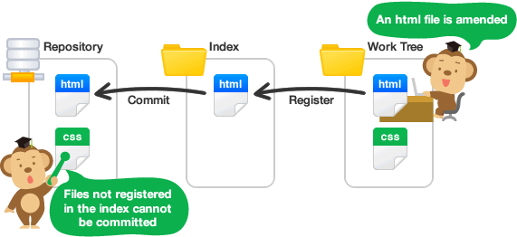

# git concepts

## Core concepts

| Concept      | Explanation                                                  |
| ------------ | ------------------------------------------------------------ |
| Commit       | A Commit records changes within a file/directory             |
| Commit ID    | A 40-character checksum hash that represents the commit      |
| Working Tree | Files that you are currently working on                      |
| Index        | A staging area where new commits are prepared                |
|              | An index gives you better control on what files should be included |
| HEAD         | Current commit                                               |
| HEAD^        | Previous commit                                              |

## Share a repository

| Concept | Explanation                                                  |
| ------- | ------------------------------------------------------------ |
| Push    | Push will cause the remote repository to update and synchronize with our local repository. |
| Pull    | Pull the changes from the remote repository onto your local repository. |

